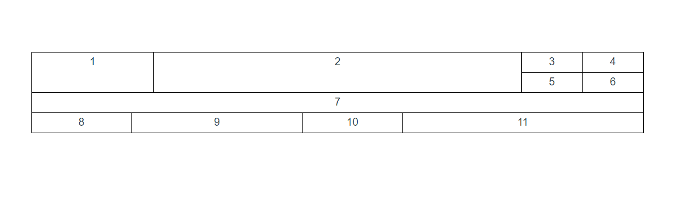

# infinite-split-table

> 通过代码配置无限分割表格，可快速实现任意布局

## 配置说明
- 每一行，每一列都可以当做一个节点
- 每个节点里可嵌套节点
- 每个节点必须由id,type,data三个字段组成
- type可选类型：
  - row：行
  - column：列
  - label：标签
  - 其他（自行扩展）
- 其他配置
  - width：节点宽（像素或百分比，父节点type为row时生效）
  - height：节点高（像素或百分比，父节点为column时生效）
  - 其他（自行扩展）
- 示例节点
  ```js
  {
    id:13,
    type:'label',
    data:'8',
    width:'150px'
  }
  ```

## 示例配置

```js
tree_data:{
  type:'column',
  id:0,
  data:[
    {
      id:1,
      type:'row',
      data:[
        {
          id:2,
          type:'label',
          data:'1',
          width:'20%'
        },
        {
          id:3,
          type:'label',
          data:'2'
        },
        {
          id:4,
          type:'column',
          width:'20%',
          data:[
            {
              id:5,
              type:'row',
              data:[
                {
                  id:7,
                  type:'label',
                  data:'3'
                },
                {
                  id:8,
                  type:'label',
                  data:'4'
                },
              ]
            },
            {
              id:6,
              type:'row',
              data:[
                {
                  id:9,
                  type:'label',
                  data:'5'
                },
                {
                  id:10,
                  type:'label',
                  data:'6'
                },
              ]
            },

          ]
        }
      ],
    },
    {
      id:11,
      type:'label',
      data:'7'
    },
    {
      id:12,
      type:'row',
      data:[
        {
          id:13,
          type:'label',
          data:'8',
          width:'150px'
        },
        {
          id:14,
          type:'label',
          data:'9'
        },
        {
          id:15,
          type:'label',
          data:'10',
          width:'150px'
        },
        {
          id:16,
          type:'label',
          data:'11'
        },
      ]
    }
  ]
}
```
## 示例效果


